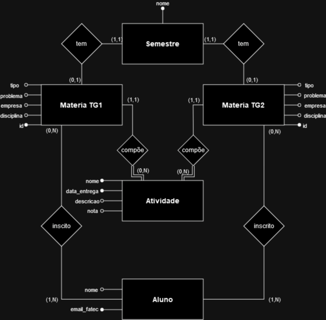

 

<h1 align="center"> FATEC Profº Jessen Vidal, SJC - 2º Semestre BD - API DevMinds </h1>
 

    <a href="#equipe">Equipe DevMinds</a>  |
    <a href="#Objetivo">Objetivo</a>  |  
    <a href="#backlog">Backlog do Produto</a>  |
    <a href="#modelo">Modelo de Dados</a>  |
    <a href="#tecnologias">Tecnologias</a>

 

<h2> 🎓 Equipe DevMinds</h2>
    

| Função | Nome | GitHub | LinkedIn |
| :---: | :---: | :---: | :---: |
| PO | Samantha Nogueira | |  |
| SM | Letícia Castro | |  |
| DT | João Ávila | |  |
| DT | André Wakugawa | |  |
| DT | Ricardo Reis | | 
| DT | Cauê Silva | |  |
| DT | Miguel Arcanjo | |  |
| DT | Gabriel Guska | | |

 

<h2> :briefcase: Objetivo do Projeto </h2>

 Desenvolver uma ferramenta para visualização e organização das turmas de Trabalho de Graduação (TG) 

 

<h2> :bookmark_tabs: Backlog do Produto </h2>

Prioridade | Backlog do Produto | Status |
----|------------------- | ------
#1 | Criar Github | Alto |
#2 | Esboço da idéia | Alto |
#3 | Criação wireframe de visualização | Alto |
#4 | Modelagem inicial do banco de dados | Alto |
#5 | Adicionar o membros do time no GitHub | Baixa |
#6 | Descrição do Objetivo de forma clara | Média |
#7 | Configuração readme do GitHub | Alta |
#8 | Criar um importador de tabela | A fazer |
#9 | Enviar dados vitais | A fazer |
#10 | Salvar dados formatados de forma local | A fazer |
#11 | Amadurecer a modelagem de banco de dados | A fazer |
#12 | Criação banco de dados | A fazer |
#13 | Importação de dados para o banco de dados | A fazer |
🔗 | [Backlog por Sprint](https://docs.google.com/document/d/1-WbsinAlU2JVyuH2h__qMYZgRhSz0zLJrE_00sDiLTE/edit). | 
 

<h2> :clipboard: Modelo de Dados</h2>
<h1 align="center">
  
Imagem da modelagem

  
</h1>

<h2> :clipboard: 🎯 Entregas</h2>

Sprint ID | Período |
----------|--------|
#1 | 04/09 - 24/09 |
#2 | 25/09 - 15/10 |
#3 | 16/10 - 05/11 |
#4 | 06/11 - 26/11 |
 

  <h2>:wrench: Ferramentas Utilizadas</h2>

  ### Comunicação

  ### Tecnologia

 

 
	
<h2>:bulb: Metodologia Utilizada</h2>

* **Metodologia Ágil:** Framework [Scrum](https://blog.contaazul.com/metodologia-scrum#:~:text=a%20planilha%20agora-,O%20que%20%C3%A9%20a%20metodologia%20Scrum,desenvolvedores%20de%20softwares%20e%20sistemas.)  

	`PO - Product Owner` 
	`SM - Scrum Master` 
	`DT - Developers Team`  

 
 <h5 align="center">  API - 2023-2 - Fatec São José dos Campos </h5>
 
 → [Voltar ao topo](#topo)
